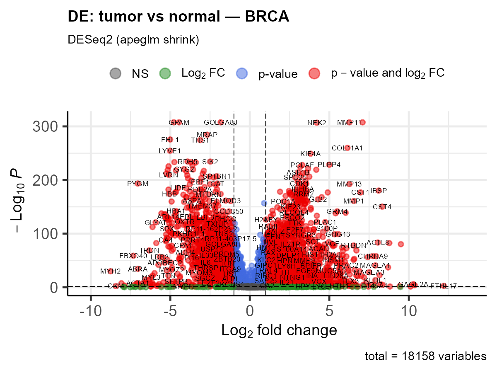
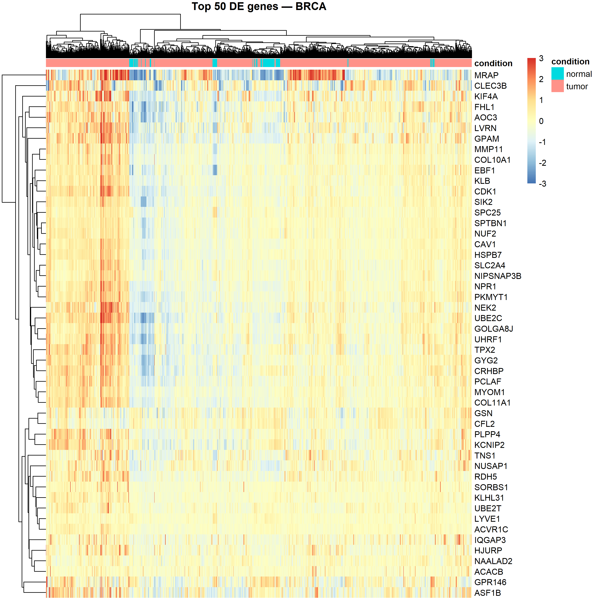
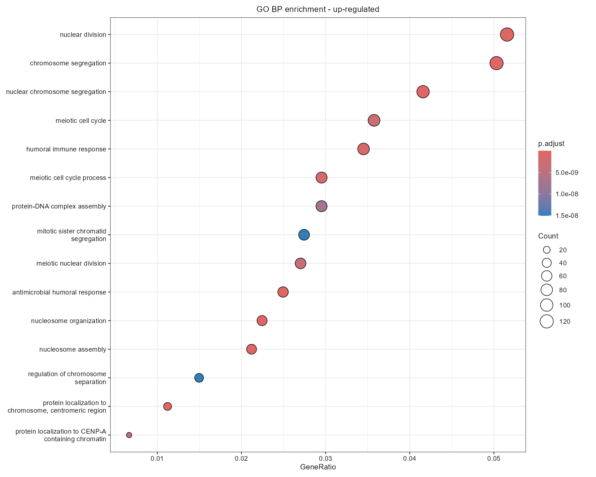
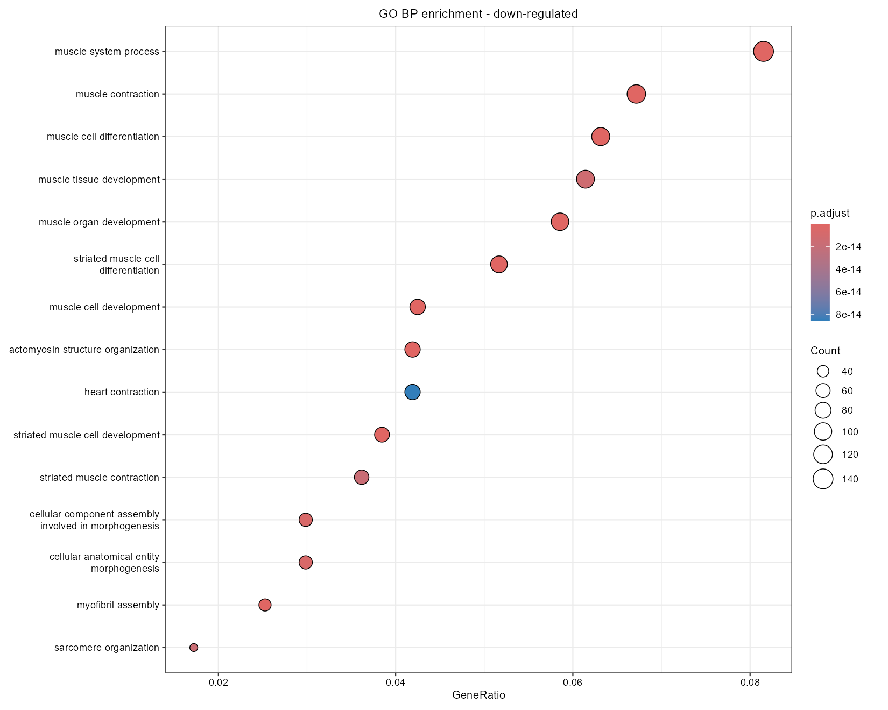
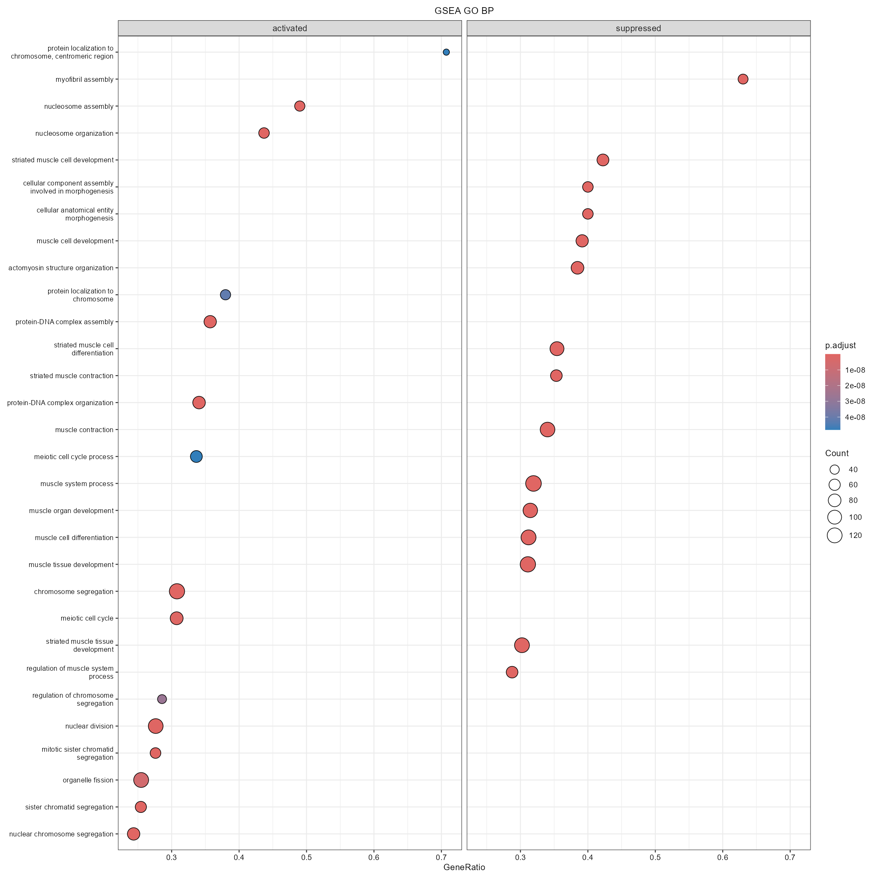
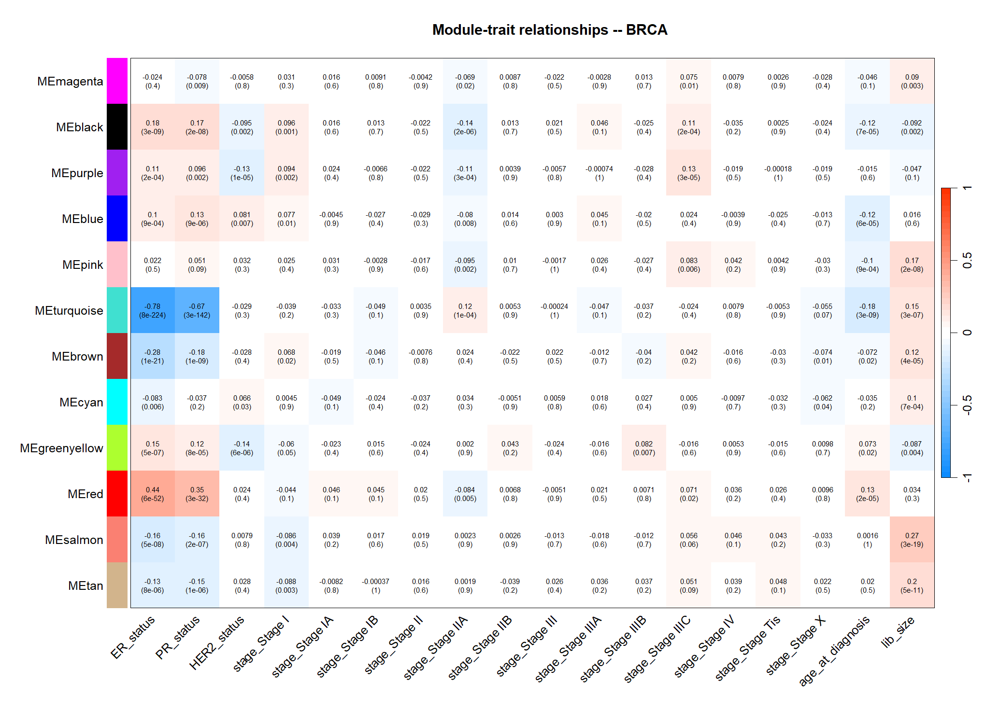
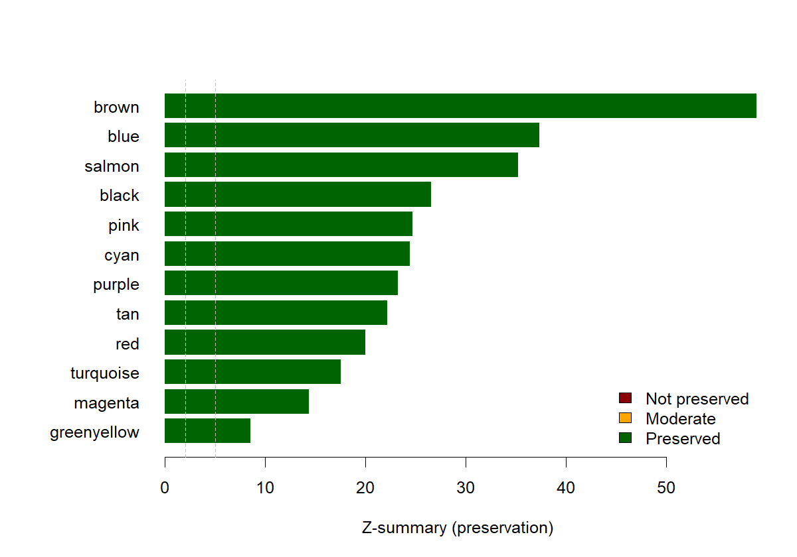
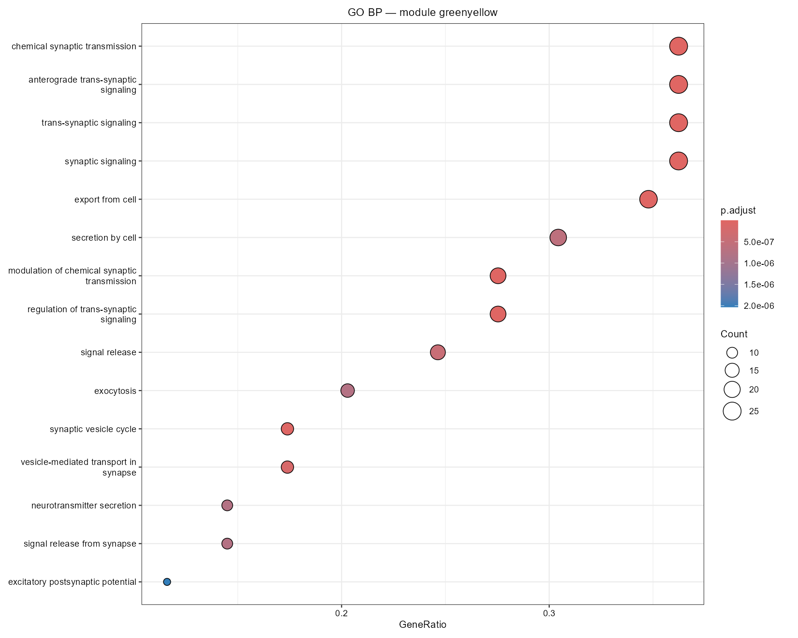
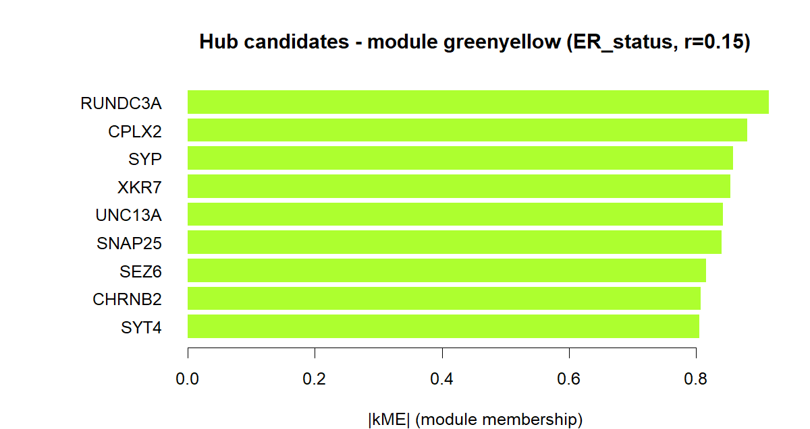
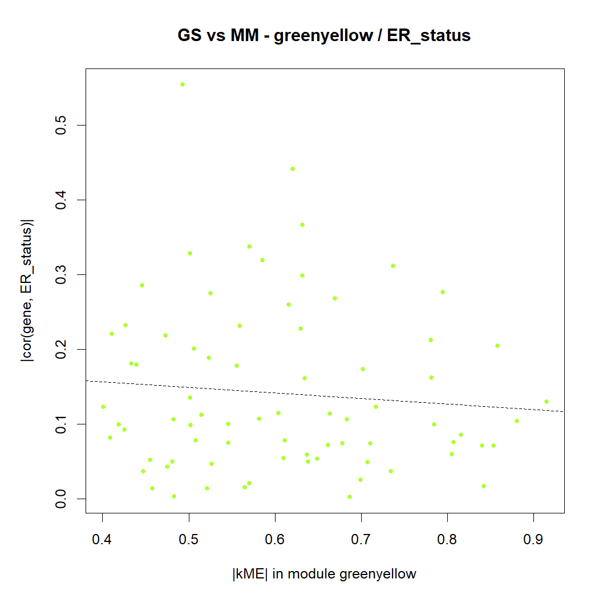

# TCGA-BRCA RNA-seq Differential Expression And WGCNA Report

This Markdown report is a GitHub-readable companion to the Quarto HTML report.
GitHub renders this file directly in the repository, so it is useful when
GitHub Pages is not enabled yet.

The analysis asks:

> Which tumor-associated expression programs and co-expression modules are
> visible in TCGA-BRCA, and which hub genes best represent those programs?

## Analysis Summary

| Area | Result |
|---|---:|
| TCGA-BRCA samples | 1,207 |
| Tumor samples | 1,095 |
| Normal samples | 112 |
| Genes tested for differential expression | 18,158 |
| Significant DE genes, padj < 0.05 and abs(log2FC) > 1 | 4,823 |
| Up-regulated genes | 2,854 |
| Down-regulated genes | 1,969 |
| Genes used for WGCNA | 5,000 |
| Non-grey WGCNA modules | 12 |
| Priority hub-gene rows | 188 |

## Workflow

| Step | Script | Purpose |
|---|---|---|
| 01 | `workflow/scripts/01_load_and_qc.R` | Load TCGA-BRCA counts and sample metadata |
| 02 | `workflow/scripts/02_differential_expression.R` | DESeq2 tumor-vs-normal differential expression |
| 03 | `workflow/scripts/03_wgcna.R` | Tumor-only WGCNA module detection and trait correlation |
| 04 | `workflow/scripts/04_enrichment.R` | GO/KEGG enrichment for differential-expression results |
| 05 | `workflow/scripts/05_module_enrichment.R` | GO/KEGG enrichment for each WGCNA module |
| 06 | `workflow/scripts/06_module_preservation.R` | Tumor-vs-normal module preservation |
| 07 | `workflow/scripts/07_hub_genes.R` | Hub-gene ranking and priority module selection |
| 08 | `workflow/scripts/08_render_report.R` | Render the Quarto HTML report |

## Differential Expression

The tumor-vs-normal DESeq2 analysis identified 4,823 significant genes using
`padj < 0.05` and `abs(log2FC) > 1`. Of these, 2,854 were up-regulated and
1,969 were down-regulated in tumor samples.





## Functional Enrichment

Up-regulated genes are dominated by chromosome segregation, nuclear division,
and cell-cycle programs. Down-regulated genes are enriched for muscle,
contractile, and tissue-organization programs.





The GSEA summary shows the same broad contrast: proliferative/cell-cycle
programs are activated, while several tissue-structure and contractile programs
are suppressed.



## WGCNA Modules

WGCNA was run on tumor samples so modules capture tumor expression structure
rather than simply separating tumor from normal samples.



Key module annotations:

| Module | Size | Main annotation |
|---|---:|---|
| turquoise | 1,757 | chromosome segregation and nuclear chromosome segregation |
| brown | 695 | lymphocyte activation and leukocyte activation |
| blue | 436 | extracellular matrix organization |
| salmon | 423 | cytoplasmic translation and translation |
| black | 218 | vasculature development and blood vessel development |
| pink | 114 | collagen metabolic process and extracellular matrix organization |
| greenyellow | 75 | chemical synaptic transmission and trans-synaptic signaling |

## Module Preservation

Most non-grey tumor modules are preserved when compared against the normal
sample network. The greenyellow module is also preserved, with
`Zsummary = 8.52`, so it should not be described as a not-preserved or
tumor-specific rewiring module.



| Module | Zsummary | Class |
|---|---:|---|
| brown | 59.08 | preserved |
| blue | 37.39 | preserved |
| salmon | 35.22 | preserved |
| black | 26.56 | preserved |
| pink | 24.73 | preserved |
| turquoise | 17.52 | preserved |
| greenyellow | 8.52 | preserved |
| grey | -0.43 | not_preserved |

## Greenyellow Module

The greenyellow module is biologically important because it has a strong,
coherent synaptic/neurotransmitter annotation even though its clinical trait
correlation is modest and it is preserved in the normal comparison network.



Top greenyellow hub genes:

| Gene | kME | log2FC | padj | Priority reason |
|---|---:|---:|---:|---|
| RUNDC3A | 0.92 | 3.15 | 4.47e-27 | enriched |
| CPLX2 | 0.88 | 6.60 | 8.35e-33 | enriched |
| SYP | 0.86 | 1.65 | 9.41e-18 | enriched |
| XKR7 | 0.85 | 4.88 | 7.83e-31 | enriched |
| UNC13A | 0.84 | 4.03 | 2.91e-59 | enriched |
| SNAP25 | 0.84 | 1.73 | 1.37e-04 | enriched |
| SEZ6 | 0.82 | 3.75 | 9.28e-20 | enriched |
| CHRNB2 | 0.81 | 0.72 | 1.19e-03 | enriched |
| SYT4 | 0.81 | 4.22 | 1.16e-05 | enriched |





## Interpretation

The analysis recovers expected breast-cancer expression programs, including
cell-cycle activity, immune activation, extracellular matrix remodeling, and
angiogenesis. The greenyellow module adds a less obvious but coherent
synaptic/neurotransmitter signal. Because it is preserved, the cautious
interpretation is not "tumor-specific rewiring"; it is a preserved module with
strong functional enrichment and highly differentially expressed hub genes.

## Limitations

- This is a public-data reanalysis, not a clinical validation study.
- TCGA bulk RNA-seq mixes tumor cells, immune cells, stromal cells, and other
  cell types.
- Clinical trait fields can be sparse or inconsistently coded.
- Hub genes are candidates for interpretation, not proven drivers.
- Additional validation would be needed before making mechanistic or clinical
  claims.

## Reproducibility

Run the numbered analysis scripts from the repository root:

```r
source("run_01_to_07_in_rstudio.R")
source("workflow/scripts/08_render_report.R")
```

The main configuration file is:

```text
config/config.yaml
```

The Quarto HTML report source is in `report/report.qmd`, and the rendered HTML
file is `docs/index.html`. GitHub shows that HTML file as source code in the
repository browser; once GitHub Pages is enabled from `main / docs`, it is
served as a normal webpage.
